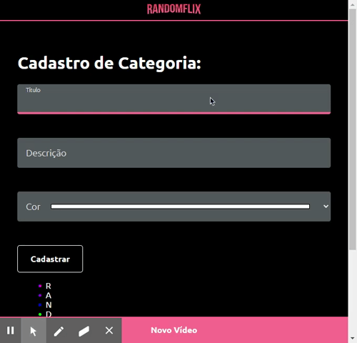
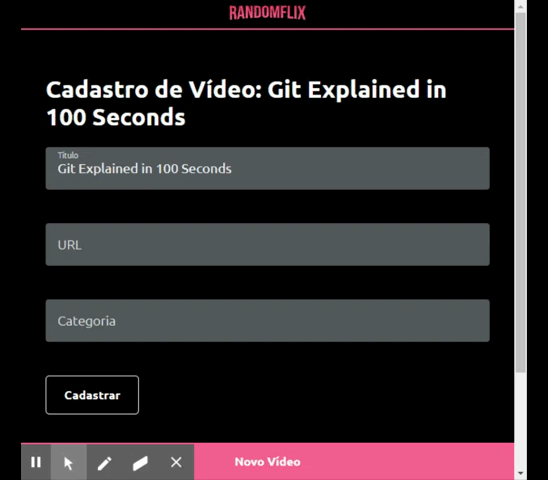
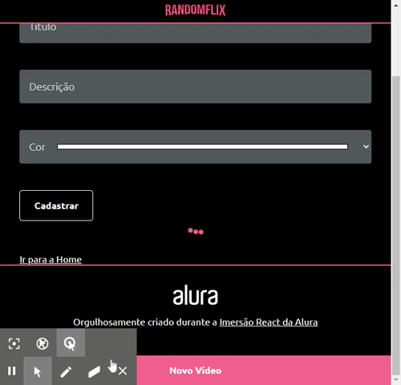
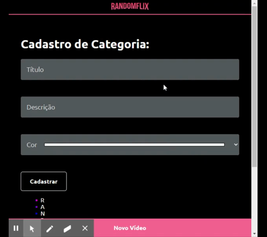

<h1 align="center">
RandomFlix
</h1>

Video plataform inspired on Netflix.

Deployed <a href="https://randomflix-ruby.vercel.app/">here</a>.

  
  

## Techs

- [x] [React.js](https://reactjs.org/)
- [x] [Styled Components](https://styled-components.com/)
- [x] [Json Server](https://www.npmjs.com/package/json-server)

## Pages

<h3>Home</h3>

<h3>Add Category</h3>

<h3>Add Video</h3>

## Animations

<h3>Loading</h3>

<h3>Select Form Field</h3>

## Usage

1. Run `npm install` or `yarn install`. 
2. Run `npm run dev` or `yarn dev` and access `http://localhost:3000` for the app and `http://localhost:8080` for the API. 

## Acknowledgments

This project was made during the [Imersão React](https://www.alura.com.br/imersao)